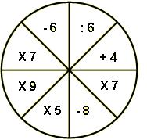

## Enunciado

Raúl piensa un número entero comprendido entre 1 y 9, y a ese número le efectúa sucesivamente en el orden de la figura las 8 transformaciones que hay en ella, obteniendo como resultado final el número 800. ¿Qué número ha pensado Raúl? ¿Por qué transformación empezó? ¿En qué sentido ha girado?

