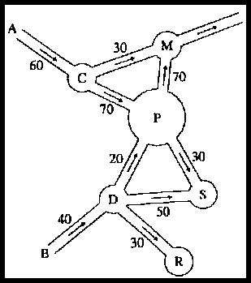

## Enunciado

La figura representa una parte de las vías de tráfico de una ciudad. Todo el tráfico entra por dos vías (A y B). Por A entra el 60 % del tráfico y por B el 40 % restante. En cada vía está señalado el sentido y el porcentaje de tráfico que admite.

Se indica que el 30 % del tráfico que llega a X sale hacia Y.

a) ¿Qué porcentaje de tráfico llega a la plaza S?

Si podemos modificar los porcentajes de circulación en las vías C a M, C a P, D a P y D a S:

b) ¿Cómo hemos de modificarlos para que a S llegue el 23 % del tráfico de la ciudad?
