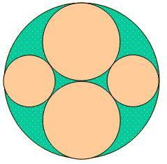

## Enunciado

Tenemos un mosaico circular con un diseño como el de la figura, en el que la parte sombreada es de cerámica de gres. El radio del mosaico es de 3m. ¿Cuál es la superficie de cerámica que hay en el mosaico?

