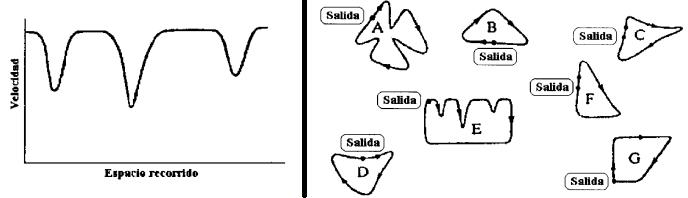

## Enunciado

El gráfico de la izquierda muestra cómo varía la velocidad de un coche de carreras durante la segunda vuelta de una carrera. Naturalmente la velocidad del bólido varía con la forma de la carretera.

¿En cuáles de los circuitos de la derecha puede estar corriendo? Indica las razones por las que rechazas cada circuito que no sirve.

