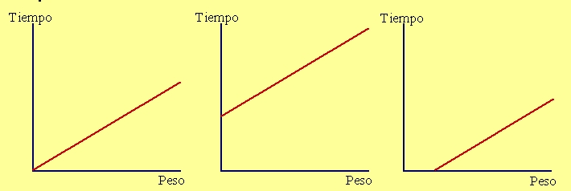

## Enunciado

Un libro de cocina da estas instrucciones para asar carne:

«Se ha de poner al horno durante 25 minutos, a esto hay que añadir 10 minutos más por cada kilo de carne que cocinamos».

¿Cuál de estas tres gráficas muestra la relación entre el peso que vamos a asar y el tiempo de cocción? Razona la respuesta.

