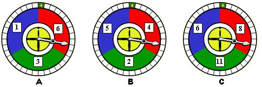

## Enunciado

Juan tiene las ruletas A y B y María, la C. Juegan de la siguiente forma:

Hacen girar las ruletas, y Juan gana si la suma de los números que obtenga en las suyas, es superior al número obtenido por María.

¿Quién crees que tiene más probabilidades de ganar?

