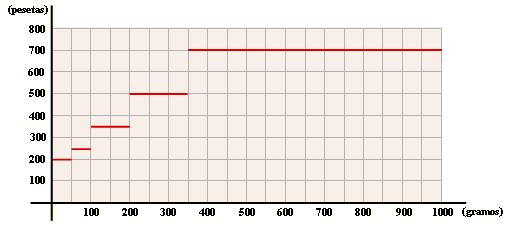

## Enunciado

La gráfica adjunta, representa los precios de correos para el envío de cartas urgentes:

a) ¿Cuánto nos costará enviar una carta de 238 gramos?

b) Con 430 pesetas, ¿qué tipo de carta podremos enviar?
