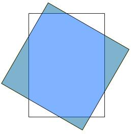

## Enunciado

Sobre la hoja de formato A4 que se te entrega, se ha intentado dibujar un cuadrado, pero es tan grande que los vértices del mismo quedan fuera. Sólo se han podido dibujar los segmentos que aparecen en la hoja.

¿Cuál será el área del cuadrado que se quería dibujar?

