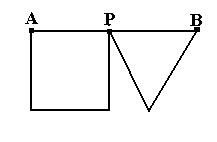

## Enunciado

El segmento AB mide 21 cm de longitud. El punto P se coloca de forma que el cuadrado y el triángulo equilátero tengan el mismo perímetro. ¿Cuánto mide el segmento AP? ¿Cuál será el perímetro de ambas

figuras?

