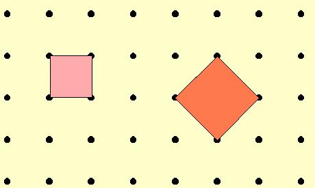
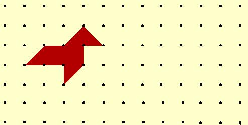

## Enunciado

Observa los dos cuadrados siguientes y di qué relación hay entre sus áreas:

Basándote en lo anterior, dibuja una pajarita con la misma forma que la de la figura pero cuya superficie sea el doble de la misma.

