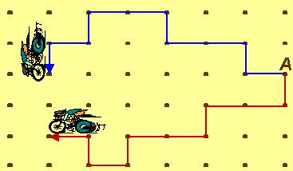

## Enunciado

La siguiente gráfica muestra el recorrido de dos ciclistas que parten simultáneamente del punto A, con la misma velocidad constante de un paso por segundo (un paso es la distancia vertical u horizontal entre dos puntos consecutivos).

Resuelve las siguientes cuestiones:

       a) Haz una gráfica que muestre la distancia que ha habido entre ambos en todo el recorrido.

       b) Si ambos llevan un teléfono móvil cuyo alcance es de 3 pasos, ¿en qué momentos se han podido comunicar?

       c) Imagina ahora que el ciclista cuyo camino está punteado ha recorrido todos los tramos rectos en el mismo tiempo. Haz una gráfica que muestre la velocidad que ha llevado en todo su recorrido.
