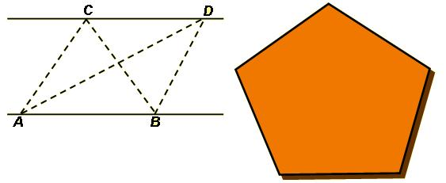

## Enunciado

Los triángulos ABC y ABD tienen la misma superficie, ya que sus bases y sus alturas son iguales.

Usando lo anterior, dibuja un triángulo que tenga la misma superficie que el polígono dibujado.
