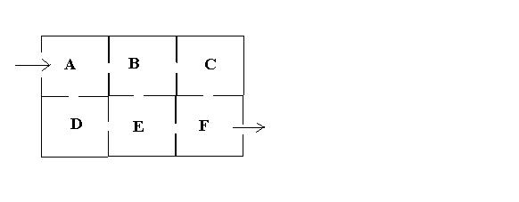

## Enunciado

a) ¿Cuántos caminos diferentes hay en el siguiente plano, desde la entrada hasta la salida, sin pasar dos veces por el mismo sitio?

b) ¿Cuál es la probabilidad de encontrar la salida sin pasar por la habitación E?
