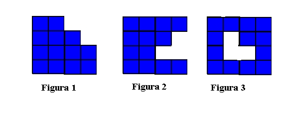

## Enunciado

Las tres figuras siguientes están formadas por 13 cuadrados cada una.

Divide la figura 1 en dos partes, de tal forma que reagrupándolas de otra forma se puedan construir las otras dos figuras.

