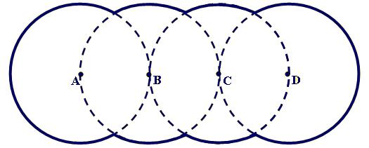

## Enunciado

Encuentra la longitud de la trayectoria curvilínea marcada continuamente en grueso.

Los círculos tienen los centros en A, B, C y D. El radio es el mismo para los cuatro círculos, de 5 cm.
