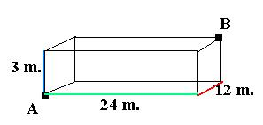

## Enunciado

El mosquito Pepito se encuentra en la esquina A de una nave industrial que mide 24 metros de largo, 12 de ancho y 3 de alto, cuando divisa en el vértice opuesto B a Melinda, su mosquita preferida, ¿qué distancia habrá de volar Pepito para encontrarse con su amada Melinda?

