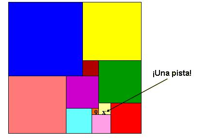

## Enunciado

La figura que ves parece un cuadrado, ¿verdad?...

    ...Pues no lo es, pero las once figuras coloreadas en las que está descompuesta sí son todas cuadradas.

    Bien, pues sabiendo que el cuadrado más pequeño tiene 9 cm de lado, calcula las dimensiones del rectángulo total.

