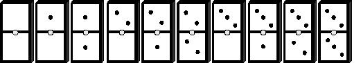
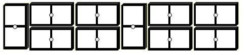

## Enunciado

Disponemos de las diez fichas del dominó siguientes:

Pues bien, colócalas como en la figura de abajo de modo que las dos filas horizontales sumen los mismos puntos y que también las diez columnas verticales sumen igual.

