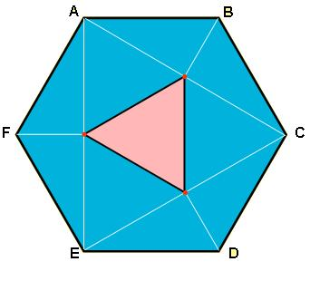

## Enunciado

El hexágono regular de la figura tiene 200 cm² de superficie. En él trazamos los segmentos AC, CE y EA y desde B, D y F trazamos los segmentos perpendiculares que se apoyan en los anteriores...

Los puntos de corte son los vértices del triángulo equilátero marcado en color rosado. Pues bien, calcula el área de este triángulo.

