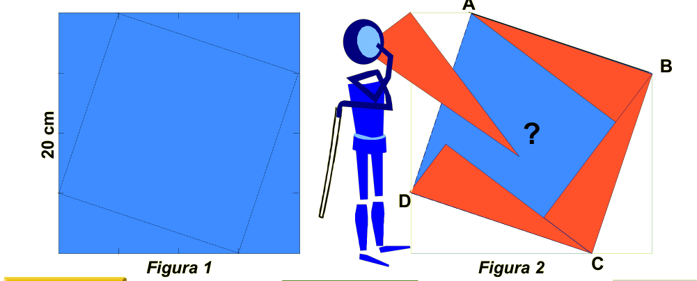
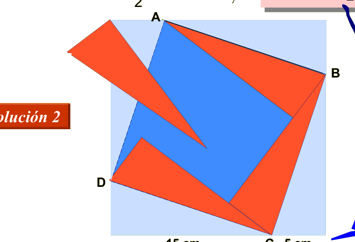

## Enunciado

Un cuadrado de papel de 20 cm de lado tiene una cara de color azul y la otra cara de color rojo. Dividimos cada lado en cuatro partes iguales y doblamos las puntas del cuadrado por los segmentos que se indican en la figura 1, con lo que obtenemos la situación de la figura 2. Pues bien, calcula la superficie del cuadrado azul y la del cuadrado ABCD que lo contiene.

## Solución

Cada lado queda dividido en dos trozos, de 5 cm y 15 cm. Los dobleces son triángulos rectángulos de catetos 5 y 15 cm, de área $\frac{5 \cdot 15}{2} = 37{,}5$ cm².

Si reproducimos el doblado sin perder de vista el cuadrado inicial, este queda formado por el cuadrado azul y 8 de esos triángulos (los 4 que se doblan y los 4 que quedan debajo de ellos). Por tanto:

$$\text{cuadrado azul} = 400 - 8 \cdot 37{,}5 = 100 \text{ cm}^2,$$

es decir, el cuadrado azul tiene 10 cm de lado. El cuadrado ABCD está formado por el cuadrado azul y los 4 triángulos doblados:

$$ABCD = 100 + 4 \cdot 37{,}5 = 250 \text{ cm}^2.$$

(Su lado es la hipotenusa de los triángulos, $\sqrt{5^2 + 15^2} = \sqrt{250}$ cm.)
