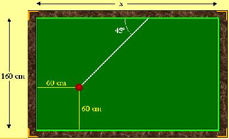

## Enunciado

En un billar de 160 cm de ancho, está colocada una bola en la parte inferior izquierda, a 60 cm de cada uno de los bordes. Esta bola es lanzada hacia la parte superior con el taco formando un ángulo de 45º con el lado mayor del billar. La bola, después de haber tocado cinco bandas, vuelve a su punto de partida. ¿Cuánto debe medir el lado más largo del billar?

