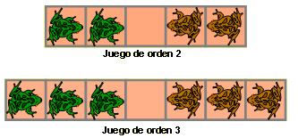

## Enunciado

En los tableros de la figuras hay ranas de dos colores. Pues bien, debes conseguir intercambiar las posiciones de las ranas, teniendo en cuenta que las ranas solo pueden avanzar, ocupando la casilla que tienen delante si está vacía o saltando sobre una rana de color distinto y ocupando la siguiente casilla siempre que ésta esté vacía.

Debes resolver primero el juego de orden dos y luego el de orden tres, registrando los movimientos que vayas efectuando en las tablas que se facilitan e indicar el número de movimientos necesario en cada caso.

## Solución

Representamos el tablero con V (rana verde), M (rana marrón) y _ (casilla vacía). Las verdes avanzan hacia la derecha y las marrones hacia la izquierda. La clave es no bloquearse: nunca hay que dejar dos ranas del mismo color juntas delante de la casilla vacía antes de tiempo, de modo que las ranas acaban alternándose.

**Orden 2: 8 movimientos.**

VV_MM → V_VMM → VMV_M → VMVM_ → VM_MV → _MVMV → M_VMV → MMV_V → MM_VV

**Orden 3: 15 movimientos.**

VVV_MMM → VV_VMMM → VVMV_MM → VVMVM_M → VVM_MVM → V_MVMVM → _VMVMVM → MV_VMVM → MVMV_VM → MVMVMV_ → MVMVM_V → MVM_MVV → M_MVMVV → MM_VMVV → MMMV_VV → MMM_VVV

En general, con $n$ ranas de cada color hacen falta $n(n+2)$ movimientos: $n^2$ saltos y $2n$ avances simples.
