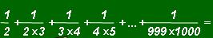

## Enunciado

Paquito Lumbreras es un monstruo de las mates pero vaya ideas que se le ocurren...

¡Qué peste! Hoy no ha tenido más que tirar una bombita fétida en la clase y no veas cómo se ha puesto la «seño» cuando se ha enterado. Le ha dicho que salga inmediatamente y que si no vuelve antes de que toque el timbre con la sumita de quebrados que aparece en la pizarra resuelta, que se vaya despidiendo del aprobado en mates.

No veas la caña que nos dio la profe con el mínimo común múltiplo y las operaciones con quebrados, pero con esta cuenta se ha pasado...

Sin embargo, Paquito lo resolvió en dos minutos y sin calculadora. ¿Qué resultado obtuvo?

## Solución

Calcular la suma directamente es inabordable, así que probamos con sumas más cortas:

$$\frac{1}{2} + \frac{1}{2 \cdot 3} = \frac{2}{3}, \qquad \frac{1}{2} + \frac{1}{2 \cdot 3} + \frac{1}{3 \cdot 4} = \frac{3}{4}, \qquad \frac{1}{2} + \frac{1}{2 \cdot 3} + \frac{1}{3 \cdot 4} + \frac{1}{4 \cdot 5} = \frac{4}{5}.$$

Cada vez que añadimos un sumando, el resultado pasa a ser $\frac{n}{n+1}$, donde $n \cdot (n+1)$ es el último denominador. Se entiende al ver que cada sumando es una diferencia:

$$\frac{1}{n(n+1)} = \frac{1}{n} - \frac{1}{n+1},$$

de modo que en la suma casi todo se cancela:

$$\left(1 - \frac{1}{2}\right) + \left(\frac{1}{2} - \frac{1}{3}\right) + \dots + \left(\frac{1}{999} - \frac{1}{1000}\right) = 1 - \frac{1}{1000}.$$

Paquito obtuvo $\dfrac{999}{1000}$.
