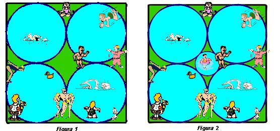

## Enunciado

En un parque municipal se han construido cuatro piscinas de la forma que se ve en la figura 1. Se quiere construir en el centro otra piscina circular más chica para los pequeños, para que los padres puedan vigilarlos, como en la figura 2.

El concejal de urbanismo dice que el radio de la pequeña será la mitad del radio de la grande, mientras que el alcalde dice que será la tercera parte. ¿Quién de los dos lleva razón?

