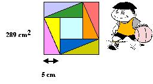
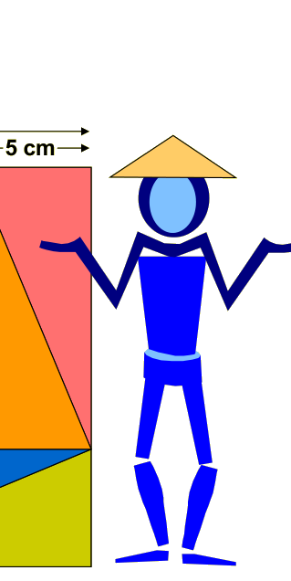

## Enunciado

En el año 300 a. C. el chino Chou Pei Suan Ching demostró el famoso teorema de Pitágoras basándose en un cuadrado similar al de la figura, formado por 8 triángulos rectángulos iguales y un cuadrado más pequeño.

Pues bien, el pequeño Chouitín te propone que calcules el área del cuadrado pequeño sabiendo sólo que la superficie del cuadrado grande es 289 cm2 y que los catetos menores de los triángulos miden 5 cm.

## Solución

El lado del cuadrado grande mide $\sqrt{289} = 17$ cm. Cada lado está formado por un cateto menor (5 cm) y un cateto mayor de un triángulo, así que los catetos mayores miden $17 - 5 = 12$ cm.

El lado del cuadrado pequeño es la diferencia entre el cateto mayor y el menor de los triángulos interiores: $12 - 5 = 7$ cm. Su área es

$$7^2 = 49 \text{ cm}^2.$$

**Curiosidad.** La figura sirve para demostrar el teorema de Pitágoras: si los triángulos tienen catetos $b$ y $c$ e hipotenusa $a$, el cuadrado de lado $a$ está formado por 4 triángulos y el cuadrado pequeño de lado $b - c$, así que

$$a^2 = 4 \cdot \frac{bc}{2} + (b - c)^2 = 2bc + b^2 - 2bc + c^2 = b^2 + c^2.$$
