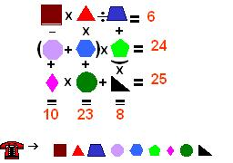

## Enunciado

María y Álvaro se han conocido en un chat. María quiere saber de dónde es Álvaro, pero Álvaro sólo le ha mandado este listado de prefijos telefónicos y el siguiente enigma donde se encuentra su número de teléfono. También le dice que contiene todos los dígitos del 1 al 9.

¿Cuál es el número de teléfono de Álvaro?, ¿dónde vive?

Alicante - 96

Asturias - 98

Barcelona - 93

Madrid - 91

Málaga,Melilla y Sevilla - 95

Valencia - 96

Vizcaya - 94

## Solución

Llamamos a las nueve casillas, en el orden en que se marcan, $a, b, c$ (primera fila), $d, e, f$ (segunda) y $g, h, i$ (tercera). Son las cifras del 1 al 9, cada una una vez.

- Todos los prefijos empiezan por 9, así que $a = 9$, y la segunda cifra $b$ es 1, 3, 4, 5, 6 u 8.
- Primera fila: $9 \cdot b : c = 6$, es decir, $9b = 6c$, $3b = 2c$. Con cifras distintas de 9 solo valen $b = 2, c = 3$ o $b = 4, c = 6$; como $b$ debe ser un prefijo, **$b = 4$ y $c = 6$**. Álvaro vive en **Vizcaya** (94).
- Tercera columna: $c + f \cdot i = 6 + f \cdot i = 8$, así que $f \cdot i = 2$: $f$ e $i$ son 1 y 2.
- Primera columna: $a - d + g = 10$, es decir, $g - d = 1$. Segunda columna: $b \cdot e + h = 4e + h = 23$.
- Segunda fila: $(d + e) \cdot f = 24$. Si $f = 1$, $d + e = 24$, imposible; así que **$f = 2$, $i = 1$** y $d + e = 12$.
- Quedan las cifras 3, 5, 7 y 8 para $d, e, g, h$. Con $4e + h = 23$: $e = 5, h = 3$ (la otra opción, $e = 4$, ya está usada). Entonces $d = 12 - 5 = 7$ y $g = d + 1 = 8$.
- Comprobación con la tercera fila: $g \cdot h + i = 8 \cdot 3 + 1 = 25$. ✓

| | | |
|---|---|---|
| 9 | 4 | 6 |
| 7 | 5 | 2 |
| 8 | 3 | 1 |

El teléfono de Álvaro es el **946 752 831** y vive en **Vizcaya**.
