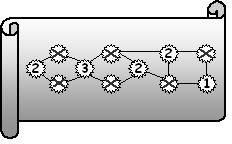
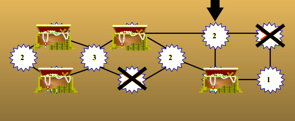

## Enunciado

El Pirata Garrapata ha encontrado un mapa del tesoro un poco extraño. Sabe que hay escondidos varios cofres con doblones de oro y no quiere dejarse ninguno atrás, pero tiene prisa ya que su gran enemigo, el Capitán Mazapán, va tras sus huellas y llegará pronto a la isla donde está el tesoro. Así que necesita saber exactamente dónde se encuentran todos y cada uno de los cofres.

En el mapa aparecen casillas con números que indican cuántos cofres hay contiguos a dicha casilla y una serie de lugares donde pueden estar los tesoros escondidos, señalados con una cruz. ¿Podrías ayudarle tú a encontrarlos?

## Solución

- El **2** de la izquierda solo tiene dos lugares contiguos, así que **hay un cofre en cada uno**.
- El **3** ya tiene esos dos cofres al lado, así que de sus otros dos lugares contiguos (el de arriba y el de abajo, a su derecha) solo uno tiene cofre.
- **Si el cofre está en el de abajo**, el 2 del centro necesita otro cofre, que solo puede estar en el lugar de abajo a la derecha; entonces el 2 de arriba a la derecha obliga a poner un cofre en la esquina superior derecha, y el **1** quedaría con dos cofres contiguos: imposible.
- Por tanto, **el cofre está en el lugar de arriba** (y no en el de abajo). El 2 del centro pide otro cofre, que solo puede estar en el lugar de abajo a la derecha. El 2 de arriba a la derecha ya tiene sus dos cofres, así que la esquina superior derecha está vacía, y el 1 tiene su único cofre contiguo.

Hay **4 cofres**: los dos de la izquierda, el de arriba en el centro y el de abajo a la derecha.

