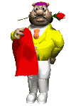
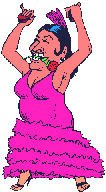

## Enunciado

En Matelandia no hay corridas de toros, por lo que cuando llega la Feria utilizan su plaza circular para celebrar las «Corridas triangulares». Consisten en numerar los seis burladeros, que están dispuestos regularmente sobre la circunferencia, del 1 al 6. Después el picador «Currito el Obtusángulo» tira un dado tres veces o las que sean necesarias hasta conseguir tres números diferentes. Currito señala esos tres burladeros y se unen con segmentos para formar un triángulo.

Este año toman la alternativa «El niño del cateto» y «La niña de la hipotenusa». Si el triángulo que forma Currito es rectángulo, «El niño del cateto» saldrá a hombros con todos los honores y si no lo es, lo hará «La niña de la hipotenusa».

¿Cuál de los dos tiene más posibilidades de ser el triunfador de la Feria?

