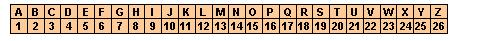

## Enunciado

Demasiadas Mates encima. A la abuela Pinto le ha dado por comunicarse en una extraña jerga que a todos nos trae locos. La clave que utiliza se basa en la tabla siguiente:

A cada letra le corresponde un número; pues bien, a dicho número debemos restarle el número de divisores que tiene; luego debemos buscar el resultado en la fila de debajo de la tabla y observar la letra que está encima; esta es la letra descifrada.

a) La abuela le ha pedido a Pepito:

*ECREWRD GR EWCHVCHQ HG QTEG*

¿Cuál debe ser la respuesta matemáticamente correcta de Pepito a su abuelita?

b) Usando la clave de la abuela Pinto, encuentra dos palabras que se puedan cifrar al menos de dos maneras distintas.

c) ¿Puedes cifrar el mensaje «OLIMPIADA MATEMÁTICA THALES»? En caso afirma-tivo cífralo y en caso negativo explica por qué no es posible cifrarlo.
