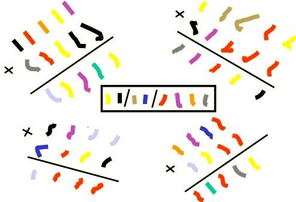

## Enunciado

Como muestra de la precocidad del pintor griego AHORADIME LOQUEPINTAS, tenemos esta obra que realizó durante su época escolar en la clase de matemáticas. En el centro aparece la fecha en la que realizó este trabajo pictórico. ¿Serías capaz de averiguarla?

