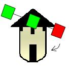

## Enunciado

Mientras D. Quijote se abalanzaba hacia los molinos para derrotar lo que creía eran malvados gigantes, Sancho comentaba a lo lejos:

*«Son curiosos esos molinos, todos son diferentes y se pueden distinguir por los colores que tienen los tres cuadrados que forman sus aspas. Los molineros sólo han usado tres colores (azul, rojo y verde) para pintarlos y hay tantos molinos como posibilidades para decorar las aspas». ¿Con cuántos «gigantes» tendrá que enfrentarse D. Quijote?*

## Solución

Colocamos las tres aspas en horizontal (izquierda, centro, derecha). Hay $3 \cdot 3 \cdot 3 = 27$ formas de pintarlas, pero un molino visto por detrás tiene los colores en orden inverso, así que, por ejemplo, rojo-verde-azul y azul-verde-rojo son el mismo molino.

Contamos según el color del aspa de la izquierda, sin repetir los ya contados:

- **Aspa izquierda azul:** el centro y la derecha pueden ser cualesquiera, $3 \cdot 3 = 9$ molinos.
- **Aspa izquierda roja:** si la derecha fuera azul, el molino ya está contado (es uno de los anteriores dado la vuelta). La derecha es roja o verde: $3 \cdot 2 = 6$ molinos.
- **Aspa izquierda verde:** la derecha solo puede ser verde: $3$ molinos.

En total, D. Quijote tendrá que enfrentarse a $9 + 6 + 3 =$ **18 «gigantes»**.
