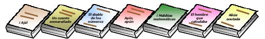

## Enunciado

El famosísimo científico Einstein presentó hace ya un siglo «la teoría de la relatividad especial». Para celebrar este centenario la librería del barrio ha organizado un concurso para sus clientes: ha colocado en hilera 7 libros y se regala el lote al primer cliente que acierte qué libro ocupa la posición 1905, contando de la siguiente manera:

¿Puedes averiguar el libro que ocupa dicha posición?
