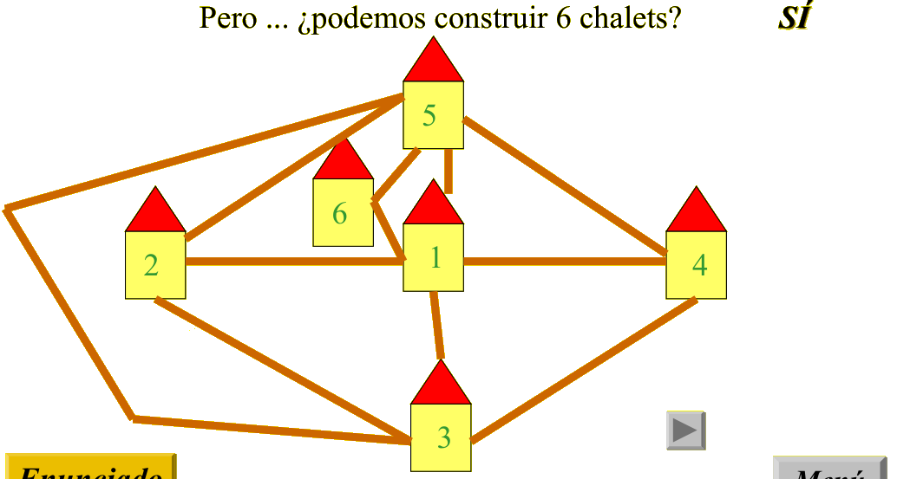

## Enunciado

El arquitecto Leonardito Eulerin, novio de la cantante Pitagorina Rubio, va a construir los chalets de una nueva urbanización. El alcalde D. Miletos no le permite construir túneles ni puentes, ni tampoco le deja que los senderos que haga se corten entre sí. Sin embargo, le deja hacer tantos chalets como pueda siguiendo una de las siguientes opciones:

1º) Que cada chalet esté unido a todos los demás por un sendero.

2º) Numerar los chalets: 1, 2, 3, 4... y unir por senderos sólo los chalets que tengan números primos entre sí.

¿Cuál es la opción que debe elegir Leonardito para construir el mayor número de chalets?

## Solución

**Opción A.** Con 2, 3 y 4 chalets es fácil dibujar los senderos sin que se corten (con 4, tres chalets en triángulo y el cuarto dentro). Pero con 5 no es posible: con los 4 primeros ya dibujados, el quinto queda dentro o fuera de alguno de los triángulos que forman los senderos y no puede llegar a todos los demás sin cruzar ninguno. Con la opción A, como mucho **4 chalets**.

**Opción B.** El 1 y los números primos son primos con todos los demás números distintos de sus múltiplos; en particular, los chalets 1, 2, 3, 5 y 7 tendrían que estar unidos todos entre sí, y eso es imposible (son 5 chalets unidos todos con todos). Por tanto no se pueden construir 7 chalets. Con 6 sí es posible: el 4 se une con 1, 3 y 5, y el 6 solo con 1 y 5, y el dibujo se puede hacer sin cruces:

Le conviene la **opción B**, con la que puede construir **6 chalets**.
