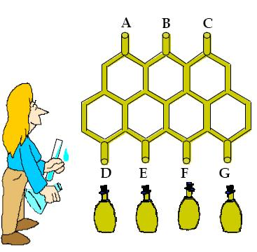
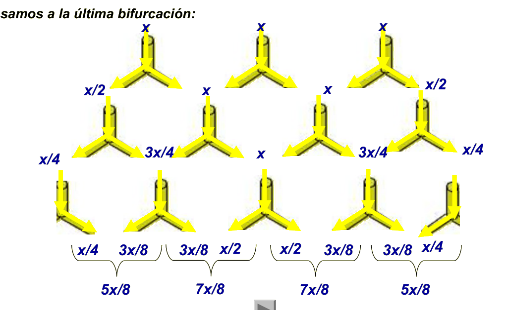

## Enunciado

Rufina es una inventora muy creativa. Ha ideado esta original máquina para el envasado de aceite de una marca de reconocido prestigio. El aceite entra de forma constante por los puntos A, B y C en la misma cantidad por cada uno de ellos y discurre a través de los conductos de la estructura hasta los puntos D, E, F, G. Se quieren llenar 1200 botellas iguales. Suponiendo que los cambios de botella no representan pérdida alguna de aceite ni de tiempo, ¿cuántas botellas se llenarán en cada uno de los puntos D, E, F, G?

## Solución

Llamamos $x$ a la cantidad de aceite que entra por cada uno de los puntos A, B y C. En cada bifurcación, el aceite se reparte a partes iguales entre los dos tubos, y cuando dos tubos se juntan, sus cantidades se suman. Siguiendo el aceite hasta abajo:

llegan $\frac{5x}{8}$ a D, $\frac{7x}{8}$ a E, $\frac{7x}{8}$ a F y $\frac{5x}{8}$ a G (en total, $\frac{24x}{8} = 3x$, todo lo que entra).

Por tanto, D y G llenan las mismas botellas, y E y F también, $\frac{7}{5}$ de las de D. Si en D se llenan $n$ botellas:

$$n + \frac{7n}{5} + \frac{7n}{5} + n = \frac{24n}{5} = 1200 \;\Rightarrow\; n = 250.$$

Se llenan **250 botellas en D y en G y 350 en E y en F**.
