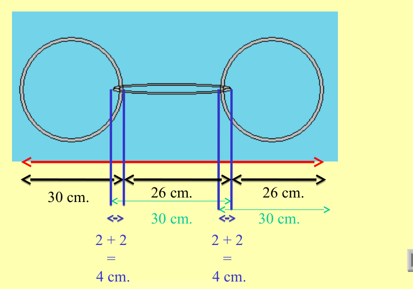

## Enunciado

El ingenioso Juan Repen vive en una casa con jardín y tiene un «feroz» perro llamado Ssuag. Juan ha encontrado en el garaje una caja con argollas circulares, y se le ha ocurrido que podría hacer una cadena con la que atar a Ssuag. Sabe que el diámetro del círculo exterior de cada argolla es de 30 cm, y el interior de 26 cm.

a. Si Juan quiere que Ssuag proteja su casa pero sin salir del jardín y la distancia entre la caseta del perro y la puerta del jardín es de 6 metros, ¿cuál será el número de eslabones que Juan necesitará para la cadena?

b. Juan tiene 651 argollas en la caja. ¿Cuál es la longitud de la cadena más larga que puede formar con ellas?

## Solución

Cada argolla tiene 30 cm de diámetro exterior y 26 cm de diámetro interior, así que su grosor es de 2 cm. Al enlazar dos argollas, se solapan los grosores ($2 + 2 = 4$ cm), de modo que cada argolla nueva añade $30 - 4 = 26$ cm:

Con $n$ argollas la cadena mide $30 + 26 \cdot (n - 1)$ cm.

a) Para que Ssuag no llegue a la puerta, la cadena no puede pasar de 600 cm: $30 + 26(n - 1) \le 600$, es decir, $n \le 22{,}9$. Necesita **22 eslabones** (la cadena mide 576 cm).

b) Con 651 argollas, la cadena mide $30 + 26 \cdot 650 = 16\,930$ cm $\approx$ **169,3 m**.
