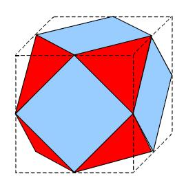

## Enunciado

D. Quijote y Sancho encuentran en la Venta de Antequera a un jugador de dados. Éste utiliza una especie de dado construido de una manera muy curiosa: se han cortado las ocho esquinas de un cubo de 10 cm de arista justo por la mitad de cada una, quedando un poliedro con seis caras cuadradas y ocho triangulares. Las caras cuadradas están pintadas de color azul y las triangulares de rojo (como las del dibujo).

D. Quijote, tras observar un largo rato el poliedro, afirma:

*"¿Has visto, fiel escudero, que este jugador ha gastado más pintura azul que roja para decorarlo?*

Sancho piensa que se equivoca. Averigua tú quién tiene razón.
