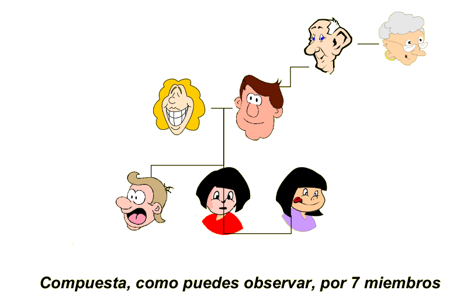

## Enunciado

La familia de Pepe Pinto está formada *exactamente* por 1 abuelo, 1 abuela, 2 padres, 2 madres, 3 nietos, 1 hermano, 2 hermanas, 2 hijos, 2 hijas, 1 suegro, 1 suegra y 1 nuera. **¿Cuál es el menor número posible de miembros de la familia?**

## Solución

Hay un suegro, una suegra y una nuera, pero ningún yerno: hay un matrimonio formado por un hijo del suegro y la suegra y su mujer (la nuera). Con estas cuatro personas ya tenemos un padre y una madre (los suegros), un hijo y la nuera.

Como hay tres nietos (un nieto y dos nietas), el matrimonio joven tiene tres hijos: un chico y dos chicas. Así:

- Los suegros son el **abuelo** y la **abuela**, y también un padre y una madre.
- El hijo es el otro **padre** y su mujer la otra **madre** (y la **nuera**).
- El chico es **nieto**, **hijo** y **hermano**; las dos chicas son **nietas**, **hijas** y **hermanas**.

Comprobamos: 2 padres, 2 madres, 2 hijos (el hijo de los abuelos y el nieto), 2 hijas, 1 hermano y 2 hermanas. ✓

La familia tiene como mínimo **7 miembros**.
