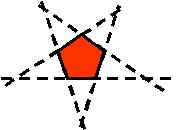
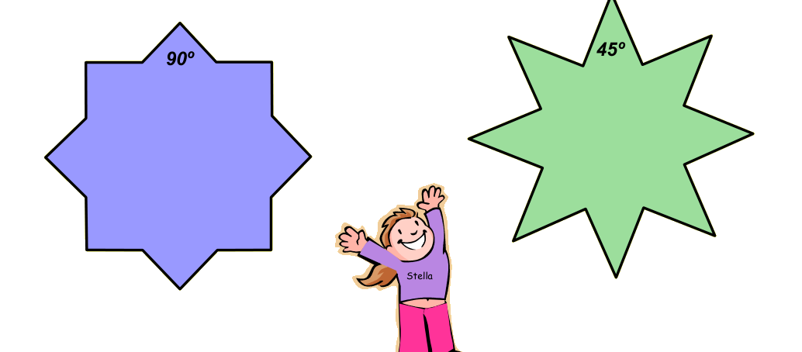

## Enunciado

Haciendo sus tareas de geometría, Estrella se dio cuenta de que si prolongaba los lados de un polígono regular, obtenía una estrella. Observa la que formó a partir del pentágono. Animada, probó con un octógono regular y con el mismo procedimiento, encontró ¡dos estrellas distintas!

**Dibuja tú esas dos estrellas y en cada caso calcula la medida del ángulo interior de las puntas.**

## Solución

Al prolongar los lados del octógono regular salen dos estrellas: una al cortarse los lados contiguos a cada lado (estrella de 8 puntas «gorda») y otra al cortarse los lados que están a dos de distancia (estrella más afilada).

El ángulo central del octógono es $360° : 8 = 45°$, así que cada ángulo interior mide $180° - 45° = 135°$.

**Primera estrella.** Cada punta es un triángulo isósceles cuyos ángulos de la base son suplementarios del ángulo interior del octógono: $180° - 135° = 45°$. El ángulo de la punta mide $180° - 2 \cdot 45° = 90°$.

**Segunda estrella.** Cada punta es un triángulo isósceles con un ángulo de 90° en el vértice opuesto (el de la punta de la primera estrella). Sus otros dos ángulos, el de la punta y su simétrico, miden $(180° - 90°) : 2 = 45°$.

Las puntas miden **90°** en una estrella y **45°** en la otra.
