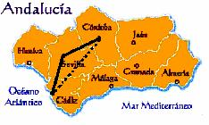
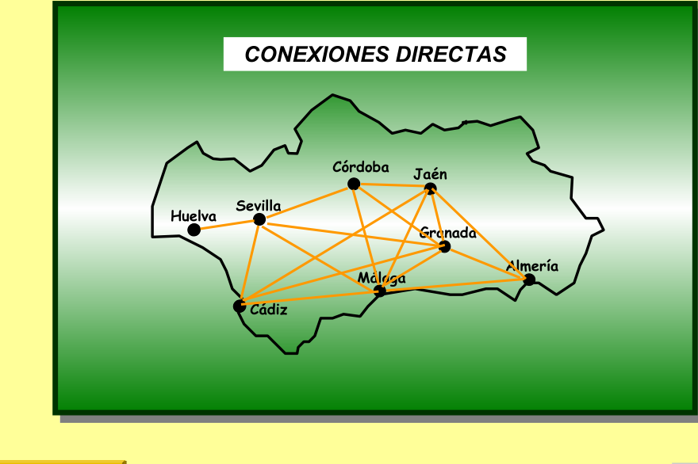

## Enunciado

El alumnado de 2.º de ESO del instituto de Matelandia va a realizar un viaje para conocer Andalucía. En un mapa de carreteras encuentran una tabla en la que las distancias kilométricas recogidas corresponden a unas determinadas conexiones entre las capitales andaluzas.

| | Almería | Cádiz | Córdoba | Granada | Huelva | Jaén | Málaga |
|---|---|---|---|---|---|---|---|
| **Cádiz** | 484 | | | | | | |
| **Córdoba** | 332 | 263 | | | | | |
| **Granada** | 166 | 335 | 166 | | | | |
| **Huelva** | 516 | 219 | 232 | 350 | | | |
| **Jaén** | 228 | 367 | 104 | 99 | 336 | | |
| **Málaga** | 219 | 265 | 187 | 129 | 313 | 209 | |
| **Sevilla** | 422 | 125 | 138 | 256 | 94 | 242 | 219 |

Si te fijas, los números te dirán que, para ir de Córdoba a Cádiz (263 km), la tabla no recoge una conexión directa, sino que te hace pasar por Sevilla (138 km + 125 km = 263 km).

**Dibuja todas las conexiones reales que se reflejan en la tabla.**

## Solución

Una distancia de la tabla entre A y B corresponde a una conexión no directa si pasa por otra ciudad C, es decir, si $d(A,B) = d(A,C) + d(C,B)$. Las distancias menores que la suma de las dos más pequeñas ($94 + 99 = 193$) son directas: 94, 99, 104, 125, 129, 138, 166 y 187.

Buscamos qué distancias son suma de otras dos de la tabla con una ciudad en común:

- $219 = 94 + 125$: Huelva–Cádiz pasa por Sevilla. (Málaga–Sevilla y Málaga–Almería, que también miden 219, son directas.)
- $232 = 94 + 138$: Huelva–Córdoba, por Sevilla.
- $242 = 104 + 138$: Sevilla–Jaén, por Córdoba.
- $263 = 138 + 125$: Córdoba–Cádiz, por Sevilla.
- $313 = 219 + 94$: Málaga–Huelva, por Sevilla.
- $332 = 166 + 166$: Córdoba–Almería, por Granada.
- $336 = 232 + 104$: Jaén–Huelva, por Córdoba (y Sevilla).
- $350 = 94 + 256$: Huelva–Granada, por Sevilla.
- $367 = 242 + 125$: Jaén–Cádiz, por Sevilla (y Córdoba).
- $422 = 256 + 166$: Sevilla–Almería, por Granada.
- $484 = 265 + 219$: Cádiz–Almería, por Málaga.
- $516 = 94 + 422$: Huelva–Almería, por Sevilla.

Las conexiones directas son las demás: Huelva–Sevilla, Sevilla–Cádiz, Sevilla–Córdoba, Sevilla–Málaga, Sevilla–Granada, Cádiz–Málaga, Cádiz–Granada, Córdoba–Jaén, Córdoba–Granada, Córdoba–Málaga, Jaén–Granada, Jaén–Málaga, Jaén–Almería, Granada–Málaga, Granada–Almería y Málaga–Almería.

