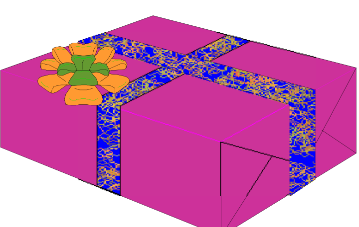

## Enunciado

Bartolomé y Pedro han comprado un regalo de cumpleaños para su madre Lucía. Para que la incógnita se mantenga hasta el final, van a esconderlo dentro de una caja que quieren que sea lo más voluminosa posible, pero para adornar la caja quieren usar una cinta muy original que han encontrado y de la que solo tienen 32 dm.

¿Cuáles serán las medidas de la caja de mayor volumen que pueden adornar, como se muestra en el dibujo, si no desperdician ningún trozo en nudos y sabiendo además que si se trabaja con decímetros no aparecen números decimales en el resultado?
