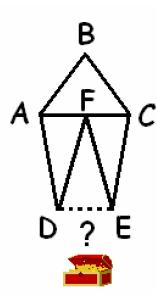

## Enunciado

Estaba el pirata Lhes poniendo a buen recaudo su último botín cuando encontró un papel viejo y roto. Al abrirlo, Lhes descubrió que se trataba de un enigma para hallar un nuevo tesoro. El lugar dentro de la isla venía marcado con una cruz pero, para poder abrir el tesoro, necesitaba conocer un número secreto.

Tal y como venía señalado, dicho número era la medida de la base del pentágono dibujado. Sabiendo que ABC es un triángulo equilátero; que ADF, DEF y ECF son triángulos isósceles e iguales (DF=EF); que ABC y ADF tienen el mismo perímetro; y que el perímetro del pentágono era 135 cm. **¿Podrías desvelarnos el número secreto DE?**

