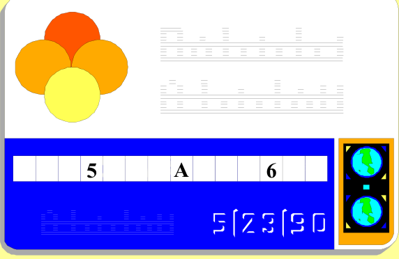

## Enunciado

A Nicole Kidgauss le han robado la cartera. Cuando ha llamado al banco para anular su tarjeta, solo recordaba los números abajo indicados y que la suma de tres cualesquiera de sus cifras consecutivas es siempre 20.

Averiguando el valor de A, resultaba más sencillo el resto de la tarjeta. **Calcula A y el número completo de la tarjeta.**

## Solución

Si cuatro cifras consecutivas son $a, b, c, d$, entonces $a + b + c = 20 = b + c + d$, así que $d = a$: las cifras se repiten cada tres posiciones, siguiendo el patrón $a\,b\,c\,a\,b\,c\,a\,b\,c \dots$

En la tarjeta de 14 cifras, el 5 ocupa la posición 4, la A la 8 y el 6 la 12; son posiciones de los tres tipos ($a$, $b$ y $c$), así que $5 + A + 6 = 20$ y **A = 9**. Como la posición 4 es de tipo $a$, la 8 de tipo $b$ y la 12 de tipo $c$, el número es

**59659659659659**.
