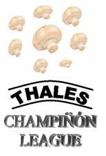

## Enunciado

En Matelandia se juega la final de la Liga de Champiñones. Han organizado un cuadrangular de fútbol, jugando una vez contra cada rival. Participan el «*Apiolín F.C*.», el «*Real Berenjena*», el «*Atlético Calabacín*» y el «*Deportivo Datilón*». Al final del torneo, cada equipo metió exactamente tres goles y no hubo dos equipos con la misma cantidad de victorias.

**¿Cuáles fueron los resultados de todos los partidos?**

## Solución

Hay 6 partidos y cada equipo jugó 3, así que como mucho ganó 3. Como no hay dos equipos con las mismas victorias, tuvieron 3, 2, 1 y 0 victorias. Llamemos Apiolín al de 3, Berenjena al de 2, Calabacín al de 1 y Datilón al de 0 (los nombres son intercambiables).

- Apiolín ganó sus tres partidos marcando 3 goles: ganó **1-0** a cada uno.
- Datilón perdió todos y marcó 3 goles, ninguno a Apiolín: repartió 1 y 2 entre sus partidos contra Berenjena y Calabacín.
- Si Datilón hubiera marcado 2 a Berenjena, esta habría necesitado 3 goles para ganarle y no le quedaría ninguno para ganar a Calabacín. Así que Datilón marcó **1 a Berenjena** y **2 a Calabacín**.
- Berenjena ganó a Datilón y a Calabacín con 3 goles: **2-1** a Datilón y **1-0** a Calabacín.
- Calabacín ganó a Datilón marcando sus 3 goles: **3-2**.

| | Berenjena | Calabacín | Datilón |
|---|---|---|---|
| **Apiolín** | 1-0 | 1-0 | 1-0 |
| **Berenjena** | | 1-0 | 2-1 |
| **Calabacín** | | | 3-2 |
