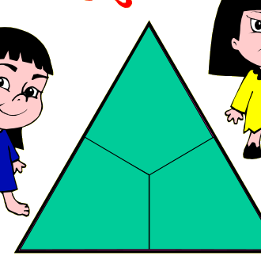

## Enunciado

Las trillizas Emi, Amalia y Noe están de cumpleaños. Su madre anda como loca porque la pastelería de Matelandia les ha mandado una tarta con forma de triángulo equilátero y ahora ha de partirla en tres trozos iguales (en forma y tamaño) para que no haya peleas. El caso es que las trillizas se empeñan en que los trozos tengan cuatro lados, aunque su madre hubiera preferido que fueran trozos de tres lados.

**¿Puedes dividir la tarta de estas dos formas?**

## Solución

**Tres trozos de tres lados.** Basta unir el centro del triángulo con los tres vértices: salen tres triángulos isósceles iguales.

**Tres trozos de cuatro lados.** Se une el centro del triángulo con los puntos medios de los tres lados. Salen tres cuadriláteros iguales, cada uno con un vértice del triángulo, dos medios lados y dos segmentos que van al centro.

(Una forma de llegar a esta división: unir los puntos medios de los lados divide la tarta en cuatro triángulos iguales; el central se reparte en tres trozos iguales uniendo su centro con sus vértices, y cada trozo se junta con el triángulo de la esquina contigua.)
