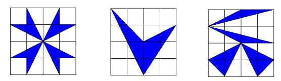

## Enunciado

El eminente arqueólogo A. C. Thalesín ha descubierto la entrada de la tumba del faraón Mathemathón IV, y en ella ha encontrado los siguientes tres símbolos acompañados de una oscura maldición egipcia que afirma que sólo tendrá una oportunidad para elegir el símbolo que abrirá la puerta. Thalesín ha estudiado la vida de Mathemathón IV, y sabe que era un gran faraón al que le gustaban las cosas grandiosas, de lo cual deduce que el símbolo que abrirá la puerta será aquel de mayor área sombreada.

**¿Podrías decidir de forma razonada cuál es la figura que abrirá la puerta?** **¿Qué área tiene cada símbolo si el cuadrado que lo contiene es de 16 unidades cuadradas? **

## Solución

Cada símbolo está dibujado en un cuadrado de 16 unidades cuadradas, una cuadrícula de $4 \times 4$. Es más fácil calcular las partes blancas y restar:

- **Figura A.** La parte blanca está formada por 4 triángulos de base 2 y altura 2 ($4 \cdot 2 = 8$ u²) y 4 cuadraditos de las esquinas (4 u²): 12 u². Parte sombreada: $16 - 12 =$ **4 u²**.
- **Figura B.** Sumando las áreas de los triángulos blancos ($\frac{2 \cdot 4}{2} + \frac{2 \cdot 3}{2} + \frac{2 \cdot 2}{2} + \dots$) salen también 12 u². Parte sombreada: **4 u²**.
- **Figura C.** Tres triángulos blancos de base 2 y altura 2 (6 u²), uno de base 4 y altura 2 (4 u²) y las dos esquinas, que forman 1 u²: 11 u². Parte sombreada: $16 - 11 =$ **5 u²**.

El símbolo que abre la puerta es la **figura C**.
