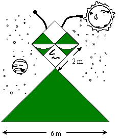

## Enunciado

La última peli de Escuadreitor, el superhéroe del planeta Quadrix, acaba de estrenarse. Los pintores de las vallas publicitarias andan como locos, porque no saben cuánta pintura necesitan, ya que no tienen ni idea de cómo calcular la superficie coloreada en verde. ¿Puedes calcularla tú?.

