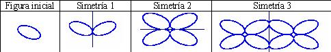
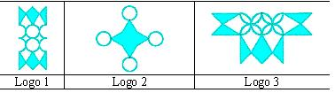
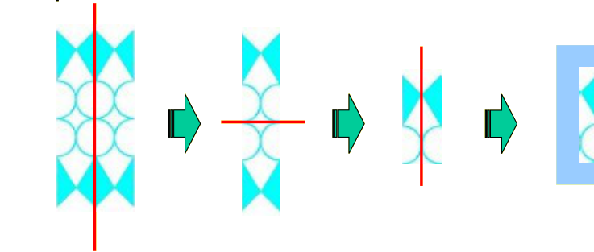

## Enunciado

Matelandia quiere organizar en el año 2016 los Juegos Olímpicos y están buscando un logotipo para la candidatura. Han hablado con Leonardo Euler que está utilizando un poco de geometría para obtener muchos logotipos. Concretamente ha estado probando a coger una figura inicial y aplicarle tres simetrías con respecto a rectas, como este ejemplo:

Euclidín ha pensado en una figura inicial distinta a la de Euler y, a partir de ella, ha formado los tres logos siguientes:

**Dibuja la figura inicial común a todas ellas y realiza un procedimiento similar al ejemplo, dibujando las tres simetrías aplicadas.**

## Solución

Conviene empezar por el final: buscar en cada logotipo un eje de simetría y quedarse con una de las dos mitades; repitiendo el proceso tres veces se llega a la figura inicial. En el logotipo 1, por ejemplo, se quita primero una mitad con un eje vertical, después otra con un eje horizontal, y una tercera vez con otro eje horizontal:

La figura que queda sirve también para los otros dos logotipos: aplicándole tres simetrías respecto de rectas convenientemente elegidas (en distinto orden y con distintos ejes) se obtienen el logotipo 2 y el logotipo 3.
