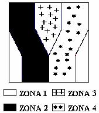
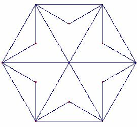
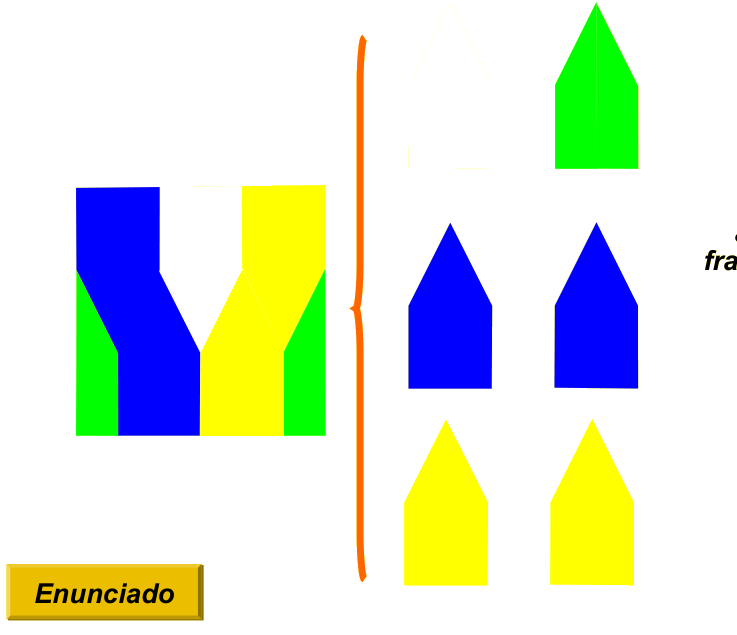
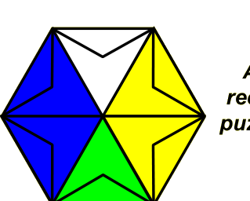

## Enunciado

Este año 2008 en todas las casetas de la feria de Todolandia han colocado un nuevo y original diseño de dianas. Luisito Ganalotodo, como es su costumbre, quiere ganar todos los premios de todas las casetas de la feria y para ello ha hecho un estudio detallado de las nuevas dianas.

**Indícale en cuál o cuáles de las zonas de la diana tiene menor posibilidad de impactar sus lanzamientos. ¿Qué fracción, con respecto a la superficie total de la diana, representa cada una de las zonas?**

Su amiga María Diseñalotodo le ha propuesto construir una diana hexagonal como la de la figura, en la que las posibilidades de impactar en cada uno de los colores fuera igual que en la cuadrada. **Ayúdale, coloreando la figura.**

## Solución

La diana cuadrada se puede dividir en 6 trozos iguales con forma de «casita»: la zona blanca es uno de ellos, la verde está formada por dos medios trozos, y la azul y la amarilla tienen dos trozos cada una.

Por tanto, la zona blanca y la verde representan cada una $\frac{1}{6}$ de la diana, y la azul y la amarilla, $\frac{2}{6} = \frac{1}{3}$ cada una. Las zonas con menos posibilidades de impacto son **la blanca y la verde**.

Para la diana hexagonal basta repartir así los 6 triángulos iguales en que se divide el hexágono: dos azules, dos amarillos, uno blanco y uno verde. Por ejemplo:

(Recombinando los trozos como en un puzle, o dividiendo cada triángulo en tres iguales, salen otros muchos diseños.)
