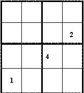

## Enunciado

En Todolandia**,** como consecuencia de los robos realizados, todos los vecinos han decidido instalar un modernísimo sistema de seguridad en todas sus viviendas. El Sr. Olvidolotodo no consigue recordar la clave de acceso a su domicilio. **Ayúdale a encontrarla**, pues, de no hacerlo correctamente, la puerta de acceso quedaría bloqueada, apareciendo además toda la policía de forma inmediata en caso de cometer un segundo error.

**Instrucciones para obtener la clave:**

- Cada una de las 16 casillas contiene un solo número entre el 1 y el 4. ** **

- No puede haber números repetidos en ninguna *fila*, en ninguna *columna*, en ninguna de las 2 *diagonales del casillero*, ni en ninguno de sus 4 *cuadrados interiores* (2x2).

## Solución

Se empieza por los cuadrados de 2 × 2 que tienen algún número y se van descartando posiciones con las reglas (no repetir en filas, columnas, diagonales ni cuadrados). Por ejemplo, en el cuadrado de abajo a la derecha está el 4; el 2 no puede ir en la columna del 2 de arriba ni el 1 en la fila del 1, y así se completa ese cuadrado; después se sigue con los demás. En un momento dado hay dos posibilidades para colocar el 1 y el 3 en una columna, y una de ellas repetiría el 1 en una diagonal. La clave es:

| | | | |
|---|---|---|---|
| 2 | 3 | 1 | 4 |
| 4 | 1 | 3 | **2** |
| 3 | 2 | **4** | 1 |
| **1** | 4 | 2 | 3 |

(En negrita, los números que se daban.)
