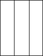

## Enunciado

A Pepito Pinto le han mandado en el colegio hacer una bandera de Andalucía coloreando tres rectángulos como en el dibujo.

Por si se equivoca le han dado un montón de fotocopias de esta hoja. Su hermano pequeño Antonio Pinto, ha cogido tres botes de pintura roja, verde y blanca, y sin que Pepito se enterara, ha empezado a colorear los tres rectángulos de todas las formas posibles con estos tres colores y luego los ha tirado por el suelo. Es un desastre, pero Pepito piensa que algunos dibujos se pueden recortar de tal forma que los trozos resultantes se puedan pegar en el orden adecuado para obtener la bandera andaluza. **¿Cuántas hojas debe recoger Pepito como mínimo del suelo para asegurarse de que al menos una le servirá para formar la bandera de Andalucía?**
